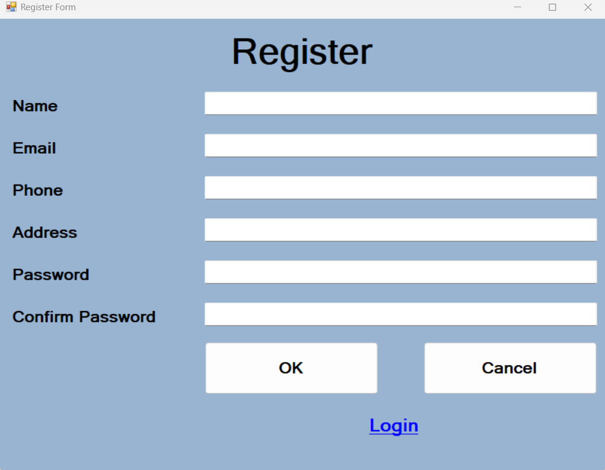
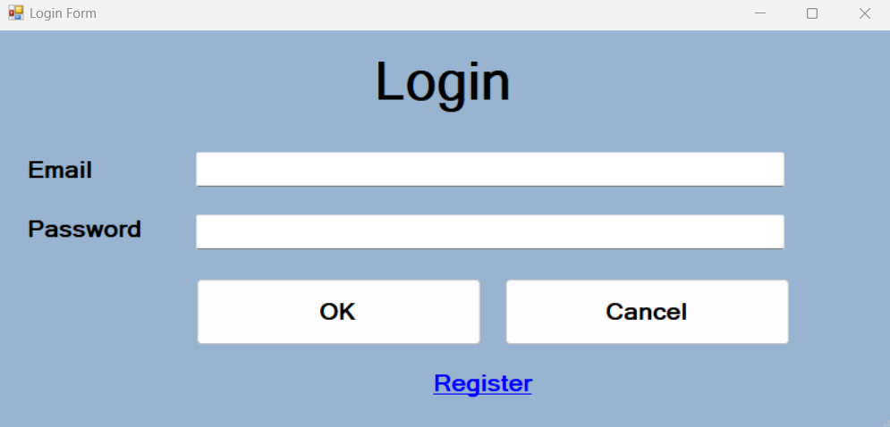

# User Authentication

MyRestaurantProject is a simple C++/CLI application demonstrating user registration, login, and dashboard functionalities for a fictional restaurant management system. The project is built using Visual Studio and the Windows Forms framework.

## Overview

The project consists of three main components:

1. **Registration Form**: Allows new users to register by providing their name, email, and address.

2. **Login Form**: Allows registered users to log in using their email and password.

3. **Main Form**: Displays user information once the user is logged in.

## Prerequisites

To build and run this project, you will need:

- Microsoft Visual Studio (2017 or later) with C++/CLI support installed
- Windows SDK for the appropriate target platform
- .NET Framework (minimum version 4.5)

## Building the Project

1. Clone the repository or download the source code.
2. Open the solution file (`.sln`) in Visual Studio.
3. Build the solution by selecting "Build Solution" from the "Build" menu.

## Running the Project

1. Run the project by selecting "Start Debugging" from the "Debug" menu, or press F5.
2. The Login Form will appear. If you don't have an account yet, click "Register" to create a new one.
3. Fill in the required fields in the Registration Form and click "Register" to create your account.
4. Once your account is created, return to the Login Form, enter your email and password, and click "Login."
5. If your login is successful, the Main Form will appear, displaying your user information.

## Contributing

Feel free to fork the repository and submit pull requests for bug fixes, improvements, or new features. Please ensure that your code follows the project's coding style and conventions.

## License

This project is released under the MIT License. For more information, see [LICENSE](LICENSE).
